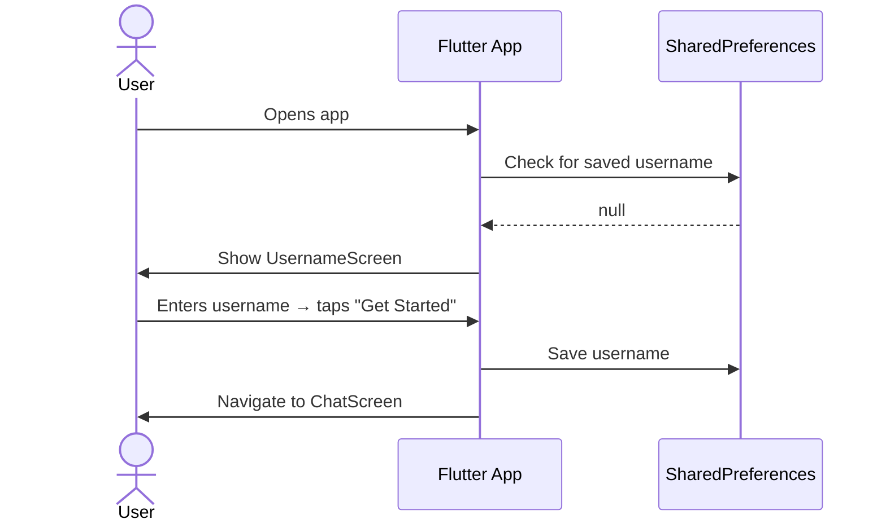
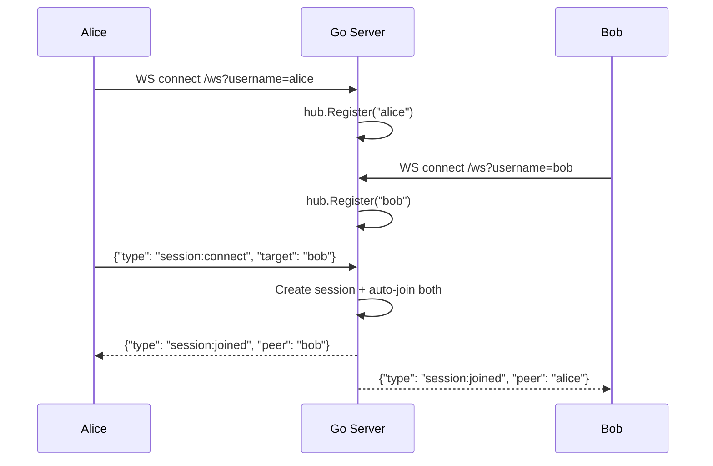
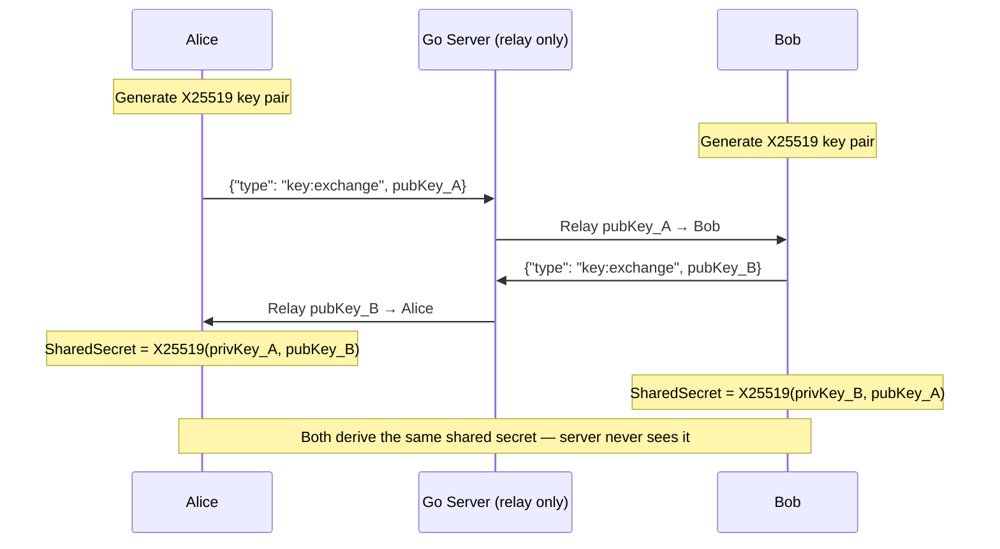
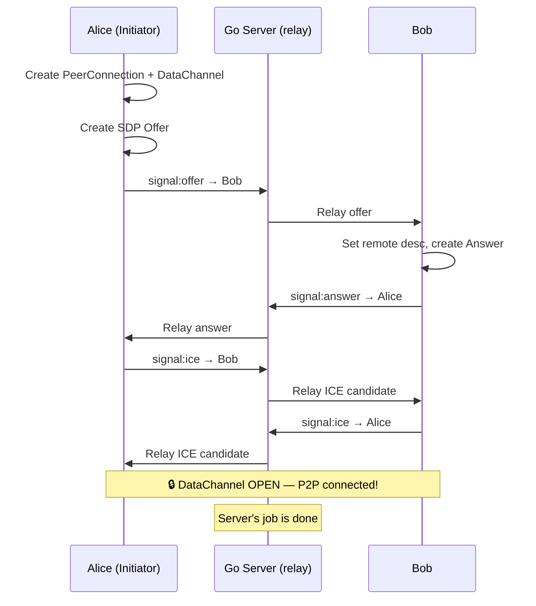
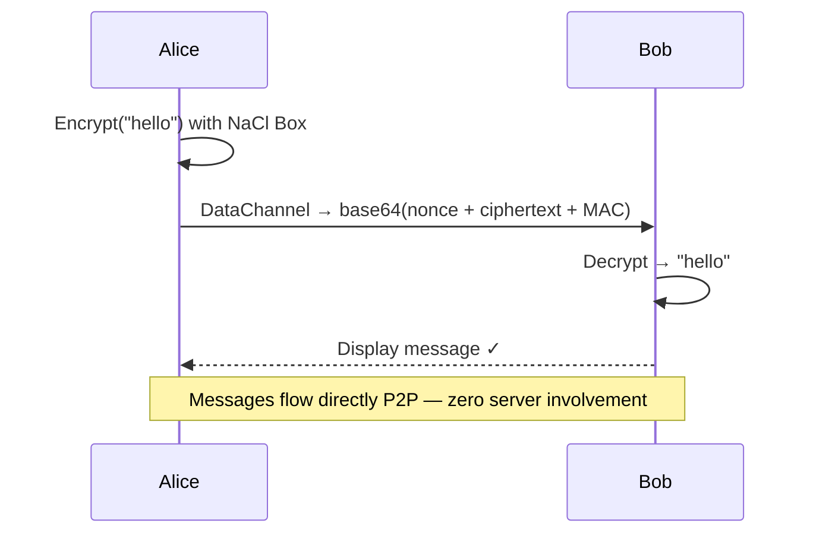
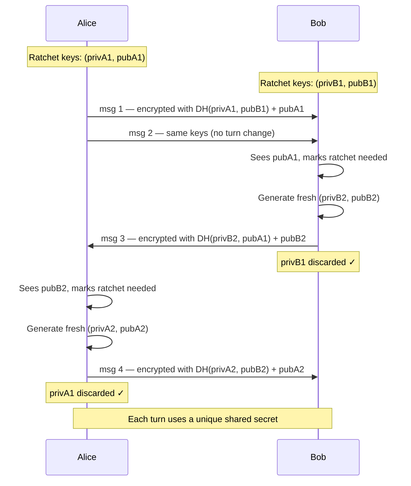

<p align="center">
  
</p>

<h1 align="center">lowkey</h1>

<p align="center">
  <b>peer-to-peer encrypted chat — your messages never touch our servers</b>
</p>

<p align="center">
  
  
  
  
</p>

---

## What is Lowkey?

Lowkey is a zero-trust, peer-to-peer encrypted chat app. The server's **only** job is matchmaking — once two users are connected, all messages flow **directly between their devices** via WebRTC DataChannel, encrypted end-to-end with **X25519 + XSalsa20-Poly1305 (NaCl Box)**.

The server **never** sees your messages or encryption keys.

---

## Architecture

```
┌──────────┐                                        ┌──────────┐
│  User A  │◄──── WebRTC DataChannel (E2E) ────────►│  User B  │
│ (Flutter) │                                        │ (Flutter) │
└────┬─────┘                                        └────┬─────┘
     │  WebSocket (signaling only)                       │
     └──────────────►┌──────────────┐◄───────────────────┘
                     │  Go Server   │
                     │  (Signaling) │
                     └──────────────┘
```

> The server relays connection setup messages only.  
> After the P2P link is established, the server is completely out of the loop.

---

## How It Works

### Phase 1 — Username Setup



### Phase 2 — WebSocket Connection & Session



### Phase 3 — Key Exchange (X25519 Diffie-Hellman)



### Phase 4 — WebRTC P2P Connection



### Phase 5 — Encrypted Chat



---

## Tech Stack

| Layer | Technology | Purpose |
|:------|:-----------|:--------|
| **Mobile App** | Flutter (Dart) | Cross-platform UI |
| **P2P Transport** | WebRTC DataChannel | Direct device-to-device messaging |
| **Encryption** | X25519 + XSalsa20-Poly1305 | End-to-end encryption (NaCl Box via `pinenacl`) |
| **Key Exchange** | X25519 Diffie-Hellman | Client-side shared secret derivation |
| **Signaling Server** | Go | WebSocket-based session matchmaking |
| **WebSocket** | `coder/websocket` (Go) | Server-side WS handling |
| **Session Store** | In-memory (Go) | Session lifecycle with TTL cleanup |
| **Deployment** | systemd + nginx | Production reverse proxy with WSS |

---

## Project Structure

```
lowkey/
├── app/                          # Flutter mobile app
│   └── lib/
│       ├── main.dart             # App entry, routing
│       ├── screens/
│       │   ├── username_screen.dart   # Username setup
│       │   └── chat_screen.dart       # Connect panel + chat UI
│       ├── services/
│       │   ├── signaling_service.dart # WebSocket client
│       │   ├── webrtc_service.dart    # PeerConnection + DataChannel
│       │   └── crypto_service.dart    # X25519 + NaCl Box
│       ├── models/
│       │   └── message.dart           # ChatMessage model
│       └── widgets/
│           └── message_bubble.dart    # Message UI component
│
├── cmd/server/
│   └── main.go                   # Server entry point
│
├── internal/
│   ├── signaling/
│   │   ├── hub.go                # WebSocket connection registry
│   │   ├── handler.go            # Message dispatch + session:connect
│   │   └── messages.go           # Protocol message types
│   ├── session/
│   │   ├── session.go            # Session struct
│   │   ├── store.go              # Store interface
│   │   └── memory_store.go       # In-memory store with TTL
│   └── config/
│       └── config.go             # Env-based configuration
│
├── deploy/
│   ├── lowkey.service            # systemd unit
│   └── nginx-lowkey.conf         # nginx reverse proxy config
│
└── README.md
```

---

## Signaling Protocol

All signaling messages follow the same envelope:

```json
{
  "type": "message:type",
  "sessionId": "uuid (optional)",
  "target": "username (optional)",
  "sender": "username (server-stamped)",
  "payload": { }
}
```

| Message Type | Direction | Description |
|:-------------|:----------|:------------|
| `session:connect` | Client → Server | Connect to a peer by username |
| `session:joined` | Server → Client | Both peers notified with each other's username |
| `key:exchange` | Client ↔ Client (via server) | Exchange X25519 public keys |
| `signal:offer` | Client → Client (via server) | WebRTC SDP offer |
| `signal:answer` | Client → Client (via server) | WebRTC SDP answer |
| `signal:ice` | Client ↔ Client (via server) | ICE candidates |
| `error` | Server → Client | Error with `code` + `message` |

---

## Cryptography

Lowkey uses a **DH Ratchet** for forward secrecy — each turn in the conversation uses a fresh X25519 key pair:



| Property | Value |
|:---------|:------|
| **Key Exchange** | X25519 Diffie-Hellman (client-side) |
| **DH Ratchet** | Fresh X25519 key pair on each turn change |
| **Symmetric Cipher** | XSalsa20-Poly1305 (NaCl Box) |
| **Nonce** | 24 bytes, random per message |
| **Forward Secrecy** | ✅ Old private keys are discarded after ratchet |
| **Key Generation** | Client-side — server never sees any secrets |
| **Message Format** | `{"rk": "<ratchet_pubkey>", "ct": "<nonce+ciphertext+MAC>"}` |

---

## Getting Started

### Prerequisites

- [Flutter SDK](https://flutter.dev/docs/get-started/install) (≥ 3.11)
- [Go](https://go.dev/dl/) (≥ 1.25)

### Run the Signaling Server

```bash
cd cmd/server
go run main.go
```

The server starts on `:8080` by default. Configure via environment variables:

| Variable | Default | Description |
|:---------|:--------|:------------|
| `PORT` | `8080` | Server listen port |
| `SESSION_TTL` | `10m` | Session expiry duration |
| `CORS_ORIGINS` | `*` | Allowed CORS origins |

### Run the Flutter App

```bash
cd app
flutter pub get
flutter run
```

> **Note**: Update the `_serverUrl` in `chat_screen.dart` to point to your server:
> - Local development: `ws://<your-ip>:8080`
> - Production: `wss://lowkey.ayushz.me`

---

## Deployment

Production runs on a VPS with:

1. **Go binary** → compiled and placed at `/opt/lowkey/lowkey-server`
2. **systemd** → `deploy/lowkey.service` for process management
3. **nginx** → `deploy/nginx-lowkey.conf` as reverse proxy with WebSocket upgrade
4. **SSL** → Let's Encrypt via Certbot for `wss://` support

---
